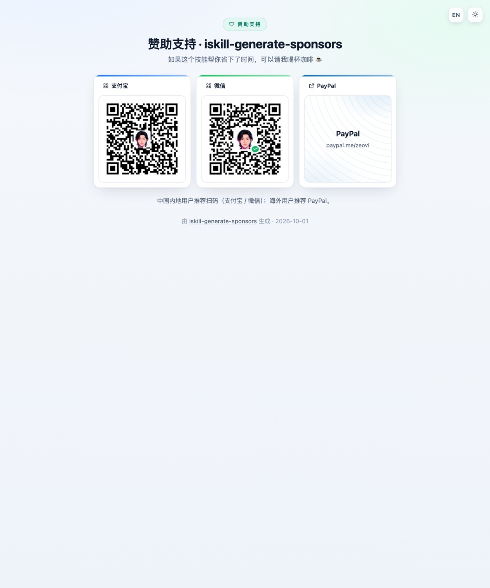
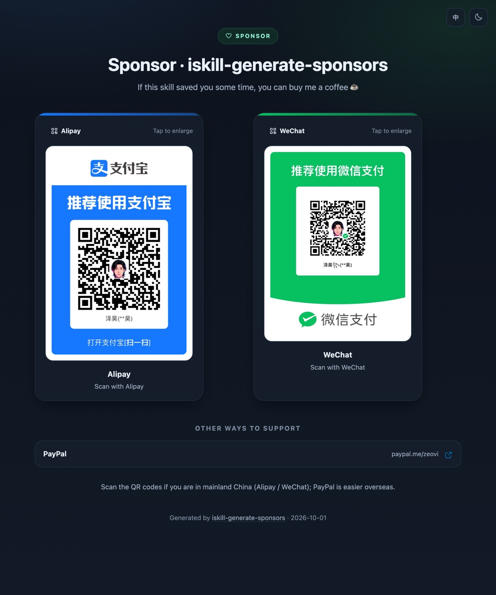
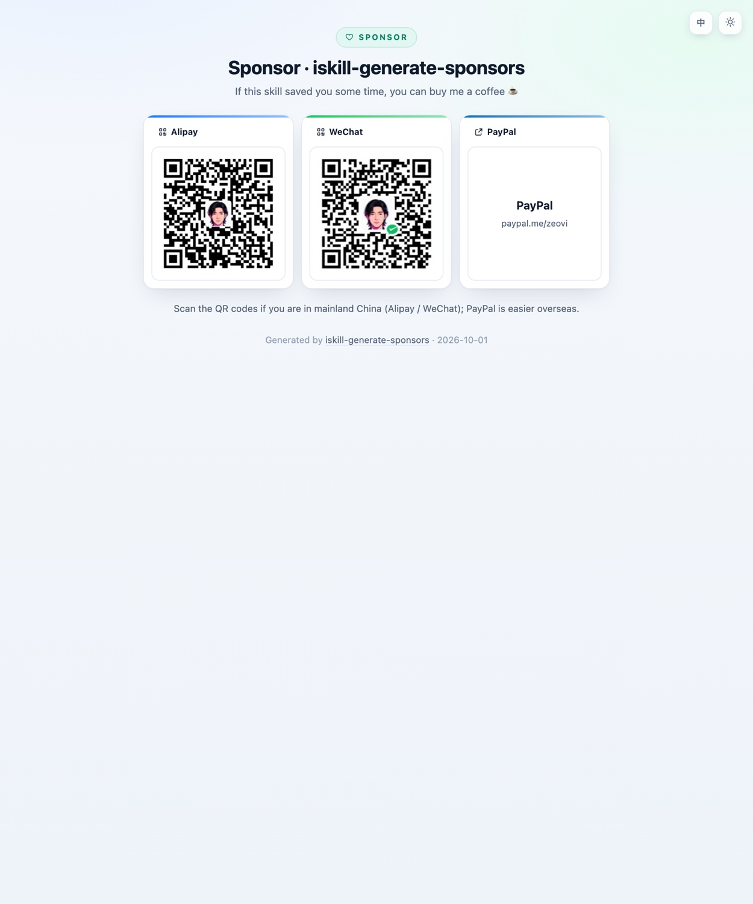

# iskill-generate-sponsors

一张收款码 → 一整套能直接用的赞助页。

```bash
bash scripts/make-all.sh --from ~/收款码 --name ZEO --paypal https://www.paypal.com/ncp/payment/SN6RMEF7FNKU4
```

产出：`.github/sponsor/*.jpg` · `.github/FUNDING.yml` · `SPONSORS.md` · `sponsors.html`（响应式 + 中英双语）·
`SponsorCard.jsx` / `SponsorCard.vue`（零依赖 scoped 组件）· README 里的内联区块（marker 包裹，重跑覆盖）。

## 样本

下面是**本技能在自身仓库上现场生成**的效果（`bash scripts/make-samples.sh` 一键重出）：

**`sponsors.html` · 固定两段式（整页卡片 + 弹层入口）**



点击二维码会开灯箱放大；右上角可切语言（中/英）和深浅色；打印样式会自动去掉按钮和页脚。
页面下半那块「也可以点开看」就是弹层入口 —— 点开即弹层。页面的形态**不再可切**：
一张图同时讲清「整页」和「弹层」两种看法。文案是**访客口吻**（这页同时是用户直接部署的赞助页）。



**弹层** —— 点页面下半那个按钮就是它：


三种赞助方式（2 张码 + 1 个 PayPal 这种）在**桌面端恒排一行**（视口 ≥ 561px），
手机上退成一行一个、卡片放大到距屏幕左右各 40px，见
[`reference/sponsor-design.md`](reference/sponsor-design.md) 的「弹层版式」节。

**README 内联区块** —— 两张码并排居中，跟着渠道表格：


**英文 / 窄屏** —— 语言与主题都**跟随系统**（`#lang=` / `#theme=` 可强制）；
窄屏（≤520px）整页的赞助方式自动堆成一行一个，卡片通栏（= 视口 − 80，即左右各 40px 边距），
内边距 / 字号 / 码面圆角跟着一起放大：




## 整体流程

```
   收款码图片（微信 / 支付宝 / 任意）
          │
          ├─ resolveQrList   按文件名/标签识别渠道（支付宝蓝 / 微信绿 / QQ / 云闪付 / PayPal）
          │
          ├─ cropQr          检测二维码并裁出主体（finder 图案定位，--skip-crop 跳过）
          ├─ optimizeImage   sips 压到长边 800 / JPEG 82  →  .github/sponsor/
          │
          ├─ FUNDING.yml     平台原生键（ko_fi/liberapay/github…）+ custom 放 PayPal（最多 4 条）
          │
          ├─ SPONSORS.md     <p align="center"> +  并排 + 渠道表格 + 嵌入说明
          │
          ├─ sponsors.html   单文件：响应式 / 中英切换 / CSS 变量深浅双主题 / 灯箱
          │
          ├─ SponsorCard.jsx / .vue   零依赖 scoped 组件（数据、样式、文案与 html 同源）
          │
          ├─ README 区块     由独占一行的 marker 包裹，重复运行只替换区块
          │
          └─ sponsor-embed.js   --mode embed：Shadow DOM 自包含片段，塞进任意已有页面
```

## 何时用

- 用户说「给项目加个赞赏 / 赞助页 / 收款码 / Sponsor 按钮」。
- 已有二维码图片，想塞进 README 但不知道怎么控制尺寸、放哪个目录。
- 想让 `github.com/用户名/仓库` 右上角出现 Sponsor 按钮。
- 想要一个能单独发出去的赞助页（`--standalone` 出来是自包含单文件）。

## 快速上手

```bash
# A. 一把梭：扫描目录，按文件名自动认渠道
bash scripts/make-all.sh --from ~/收款码 --name ZEO --paypal https://www.paypal.com/ncp/payment/SN6RMEF7FNKU4

# B. 配置驱动（推荐，长期复用；改一次以后重跑就行）
bash scripts/make-all.sh --config sponsors.config.json --out /path/to/repo

# C. 显式指定每一张
node scripts/gen-sponsors.mjs \
  --qr "支付宝=~/收款码/alipay.JPG" \
  --qr "微信=~/收款码/wechat.JPG" \
  --paypal https://www.paypal.com/ncp/payment/SN6RMEF7FNKU4 --kofi zeo --out .
```

先看看会做什么、不落盘：

```bash
node scripts/gen-sponsors.mjs --config sponsors.config.json --dry-run
node scripts/gen-sponsors.mjs --help
```

## 参数

| 参数 | 说明 |
| --- | --- |
| `--from <目录>` | 扫描目录里的图片，按文件名关键词自动识别渠道 |
| `--qr "标签=路径"` | 显式指定一张收款码（可重复） |
| `--config <文件>` | JSON 配置，默认自动读 `./sponsors.config.json` |
| `--name` / `--project` / `--tagline` / `--title` | 身份与文案 |
| `--paypal <完整URL>` | 进 `custom`（自动纠正 `paypay.me` → `paypal.me`） |
| `--kofi` `--liberapay` `--github` `--patreon` `--bmc` `--polar` `--open-collective` | 平台用户名，进 `FUNDING.yml` 原生键 |
| `--link "标签=URL"` | 额外自定义链接（可重复） |
| `--out <目录>` | 产物根目录，默认 `.` |
| `--img-base <路径>` | md/README 里引用图片的路径前缀，默认 `.github/sponsor` |
| `--pages-img-base <路径>` | html 引用图片的路径前缀，默认自动（imgBase 是点目录时用 `sponsor`） |
| `--prefix <前缀>` | 输出图片文件名前缀 |
| `--max <像素>` | 图片长边上限，默认 800 |
| `--style card\|minimal` | HTML 风格，默认 `card` |
| `--mode page\|embed` | 产物形态。默认 `page`：页面是**固定两段式**（整页卡片 + 弹层入口，形态不可切），外加 FUNDING.yml / README 区块 / 组件；`embed` **不生成页面**，只产出可嵌进任意页面的 `sponsor-embed.js`（见下节）。旧值 `inline` / `popup` / `demo` 已并入 `page`，传了只提示 |
| `--embed-out <文件>` | `embed` 片段的文件名（默认 `sponsor-embed.js`，相对 `--out`） |
| `--standalone` | HTML 内嵌 base64 图片，单文件可直接发给别人 |
| `--lang zh\|en` | 默认语言（默认 `zh`） |
| `--langs zh,en` | 可选语言集合；只给一种时隐藏切换按钮 |
| `--no-components` | 不输出 SponsorCard.jsx / SponsorCard.vue |
| `--components-dir <目录>` | 组件输出目录（默认同 `--out` 根目录） |
| `--no-source` | 不输出 `usage.html`（源码复制 / 用法页；也是本仓库落地页 Hero 槽位嵌的那个） |
| `--no-readme` / `--no-optimize` / `--dry-run` | 不写 README / 不压图 / 只预演 |
| `--skip-crop` | 跳过二维码自动裁剪 |

## 产物

| 文件 | 用途 |
| --- | --- |
| `.github/sponsor/*.jpg` | 压缩后的收款码，专供 README 内联 |
| `.github/FUNDING.yml` | 仓库右上角 Sponsor 按钮 |
| `SPONSORS.md` | 完整赞助页 + 嵌入说明 |
| `sponsors.html` | 单文件美观网页（响应式，自带中/英切换 + 深浅主题）。恒定**两段式**：上半整页卡片，下半弹层入口（点按钮开弹层，见 `assets/sample-popup.jpg`）；形态不可切 |
| `sponsor-embed.js` | **可嵌进任意页面的自包含片段**（`--mode embed`，32 KB，Shadow DOM 零依赖）：宿主只出按钮，弹层由片段自带，语言/主题跟随宿主且样式双向隔离 |
| `usage.html` | 开发者用的**源码复制 / 用法页**（中英双语）：全部文本产物分栏展示、一键复制、代码**软换行开关**、头部自带**主题切换**、底部 iframe 实时预览赞助页（首屏就与预览同色同语，`--no-source` 关掉）。**单文件零依赖** —— 也正因为如此，它能被别的页面直接 iframe 嵌走（本仓库落地页就把它嵌在 Hero 槽位里，见「落地页」节） |
| `SponsorCard.jsx` / `SponsorCard.vue` | 零依赖 scoped 组件，嵌进任意 React / Vue 项目 |
| `<pagesImgBase>/*.jpg` | 收款码的 Pages 镜像（GitHub Pages 硬封锁 `.github/*`，html 引用走这份；默认 `sponsor/`，本仓库用 `assets/sponsor/`） |
| `README.md` 区块 | marker 包裹，重跑只替换这一块 |

所有页面与组件的语言默认**跟随系统**（`navigator.language`，zh* → 中文、其余 → 英文），
完整兜底链：`#lang=` hash → localStorage（跨页共享）→ 系统语言 → `--lang` 配置默认。

## React / Vue 组件

两个组件与 `sponsors.html` **同源**：同一份 `buildModel()` 数据、同一份 `component-css.mjs`
样式骨架，只是渲染目标不同。都只依赖框架本身，不引任何三方库。

- **`SponsorCard.jsx`**：纯函数组件 + 内联 `<style>`（单标签选择器，天然免冲突），
  支持构建时可选链 + `??`（2019 年后的所有打包器都行）。SSR 可用（`renderToStaticMarkup` 直出）。
- **`SponsorCard.vue`**：`<script setup>` + `<style scoped>`，attrs 透传。
  ⚠️ 文件头部**不能有含 `<template>` 字样的 HTML 注释**——`@vue/compiler-sfc`
  的顶层解析器不管注释，见到 `<template>` 就当块开始（本技能第一版就栽在这）。

组件公共 props（都可以不传）：

```jsx
<SponsorCard />                    // 默认中文，主题跟随系统
<SponsorCard lang="en" />          // 英文
<SponsorCard theme="dark" />       // "light" | "dark" | 不传 = 跟随系统（同页多实例互不干扰）
<SponsorCard :show-tools="false" /> // 去掉右上角语言/主题按钮（嵌入文档页时用）
<SponsorCard :data="myData" />     // 换自己的数据（结构见文件里的 SPONSOR_DATA）
```

图片 `src` 是相对仓库根目录的路径；在打包器项目里建议改成 `import qr from '.../alipay.jpg'`
再塞进 data。改文案/链接/图只动文件顶部的 `SPONSOR_DATA`，不用碰逻辑。

验收方式（勿省）：两个组件都要**真编译 + SSR 渲染**过再交付——React 用
`renderToStaticMarkup`，Vue 用 `@vue/compiler-sfc` 的 `parse/compileScript/compileTemplate`
拼模块后 `vue/server-renderer` 渲染；注意 SSR harness 要给 SFC 模块设
`__sfc__.__scopeId = 'data-v-xxx'`，否则 scoped 属性不落 DOM、样式全失效
（Vite 插件在真实构建里会自动做，裸 SSR 不会）。

## 嵌入到已有页面（`--mode embed`）

不想单独发一个赞助页、只想在**自己已有的页面**上加一个「赞助」按钮时用这档：

```bash
node scripts/gen-sponsors.mjs --config sponsors.config.json \
  --out ./my-site --mode embed --pages-img-base assets/sponsor
```

产出**只有**：压缩后的收款码 + **一个 32 KB 的 `sponsor-embed.js`**（不写 `sponsors.html` /
`SPONSORS.md` / `FUNDING.yml` / 组件 / README —— 那些是另外两档的事）。

宿主侧三步：

```html
<script src="assets/sponsor-embed.js" defer></script>
<button data-sponsor-open>赞助</button>          <!-- 按钮长什么样由宿主自己定 -->
```

没有别的耦合：脚本自己建一个挂在 `<body>` 上的宿主元素，弹层 / 灯箱 / ESC / 点遮罩关闭全都自带。
**任何**带 `data-sponsor-open` 的元素都能触发（宿主自己的按钮、导航项、页脚链接都行），
后加的节点也会被自动绑定。

需要精细控制时用 `window.SponsorEmbed`：

| 方法 | 作用 |
| --- | --- |
| `open()` / `close()` / `toggle()` | 开 / 关弹层（灯箱开着时 `ESC` 先关灯箱，再按一次才关弹层） |
| `setLang('zh'\|'en')` | 强制语言；不调则**跟随宿主** |
| `setTheme('light'\|'dark'\|null)` | 强制主题；传 `null` 恢复跟随宿主 |
| `getLang()` / `getTheme()` | 读当前生效值 |
| `on('open'\|'close', fn)` | 监听开关 |
| `refresh()` | 手动重扫触发点（SPA 动态插节点时用） |
| `element()` / `data` | 拿宿主元素 / 数据模型（与 `sponsors.html`、React/Vue 组件**完全同一份**） |

**跟随宿主**的识别顺序（宿主什么都不用配）：

- 语言：`data-sponsor-lang` 属性 → `<html data-lang>` → **`<html lang>`** → `navigator.language`
  （`zh*` → 中文，其余 → 英文）；`setLang()` 优先于全部。
- 主题：`data-sponsor-theme` 属性 → `<html data-theme>` → **`<html class="dark|light">`** → 系统偏好；
  `setTheme()` 优先于全部。
- 宿主改语言 / 主题后片段**自动跟随**（监听 `<html>` 的属性变化），不需要宿主回调。

**样式双向隔离**：片段全部关在 Shadow DOM 里，宿主的 CSS 进不来（`!important` 也不行），
片段的 CSS 也出不去；唯一例外是**宿主元素本身**——片段只往它上面写 `data-theme` / `data-lang`
两个属性，其余一概不碰。片段自带 `z-index:2147483000`，宿主页有更高的层也不怕。
图片走 `--pages-img-base`（默认 `sponsor/`，建议 `assets/sponsor`），宿主页与它同级即可；
想彻底单文件（图片 base64 内嵌）加 `--standalone`。

### ⚠️ 坑：`:host[attr]` 在 Chrome 里静默不匹配，必须写 `:host([attr])`

把整页 CSS 搬进 Shadow DOM 时，`:root[data-theme="dark"]` **不能**简单替换成
`:host[data-theme="dark"]`。2026-10-02 同页对照实测：

```css
:host{--x:light}
:host[data-theme="dark"]{--x:bare-dark}      /* ← 不生效 */
:host([data-theme="dark"]){--y:fn-dark}      /* ← 生效 */
```

两条规则都正常出现在 `cssRules` 里、`selectorText` 也对、**不报任何错**，只是前者静默不匹配
（表现就是「切到深色，弹层永远是白的」）。生成器里 `toShadowCss()` 已统一改写成函数式
`:host([...])` / `:host(:not(...))`。
`body{...}` 则**故意不替换**——shadow 里没有 `body`，那几条整页背景 / 内边距自然失效，
正好是嵌入时想要的效果。

## 本仓库的落地页（`promo-page/` 目录）

仓库 `promo-page/` 目录里那个 `index.html` **不是本技能的产物**，而是用兄弟技能 `iskill-promo-page`
生成的落地页（GitHub Pages 的首页，经 `gh-pages` 分支发布）。它和本技能只有一处耦合：

```js
// 落地页 promo-page/assets/content.js
slots: { hero: { iframe: { src: "usage.html", height: 760 } } }
```

即把 `usage.html` 嵌在 **Hero 按钮下方的槽位**里 —— 访客在首页就能直接操作「分栏复制」，
不用再点走。这招能成立，全靠 `usage.html` 是**单文件零依赖**（见「产物」表那行）。

| 要点 | 说明 |
|---|---|
| 为什么进 `promo-page/` | 落地页、`usage.html`、`sponsors.html` 必须同目录（都待在 `promo-page/` 内，发布到 gh-pages 根后仍同目录）；分开后 iframe 的相对路径会在单独发布站点时断 |
| 主题 / 语言跟随 | 槽位首帧把 `#lang=&theme=` 写进 iframe 的 `src`（hash 在子页头脚本里最先读到，无竞态）；之后切换走 `postMessage`，**不重载** iframe，所以不会丢用户已切到的 tab |
| 初始化 / 重生成 | `node <promo-page>/scripts/init.mjs --target .`（生成骨架到 `promo-page/`），再 `bash <promo-page>/scripts/deploy.sh . --set-pages` 推 `gh-pages` 并翻 Pages 源 |
| 被嵌时自动收起自己的控件 | `usage.html` 头脚本判定 `window.self !== window.top`，给 `<html>` 打 `data-embedded`，CSS 借此藏掉它自带的 `中/EN` 与主题按钮 —— 否则和宿主顶栏的两个开关上下重复，看着像两张页面叠在一起。单独打开时控件照常在（三条断言见「验收」） |
| 页面本身怎么改 | 只改落地页的 `promo-page/assets/content.js`（品牌色 / 文案）与它 `promo-page/index.html` 顶部 8 行 meta，见 promo-page 的 SKILL.md |

> 槽位是**通用机制**，不止本技能在用：骨架里加一行
> `<div class="slot" data-slot="名字"></div>`，`content.js` 的 `slots` 里配同名键即可，
> **不用改 JS**。别的技能想往自己落地页塞东西也走这条路。

## 关键事实

### 微信/支付宝收款码**不能**写进 FUNDING.yml

`FUNDING.yml` 只认 GitHub 支持的那些平台（GitHub Sponsors / Patreon / Ko-fi / Liberapay /
Open Collective / Polar / Buy Me a Coffee / IssueHunt / thanks.dev），加**最多 4 个** `custom` URL。
微信/支付宝不是平台，**只能内联展示**在 README / 网页里。

本技能的做法：

- README 区块里正面展示两张码；
- `FUNDING.yml` **不写**它们，但在末尾用注释标明「码在 `.github/sponsor/`」，
  方便以后回头找；
- 海外渠道（PayPal 等）走 `custom`，能配的平台走原生键（Ko-fi / Liberapay 等可同时有）。

### `custom` 里的 URL 一定要加引号

`https://` 里的 `:` 会让一部分 YAML 解析器翻车。本技能统一输出 `- "https://..."`。
详见 [`reference/funding-yml.md`](reference/funding-yml.md)。

### 二维码自动裁剪

用户随手截的收款海报构图千差万别（logo、标语、大片品牌色背景），多张码放一起视觉很乱。
生成器默认先**定位二维码并裁出主体**：正方形、只含码本体 + 安静区（约 6% 呼吸边），
不带海报文案、不带卡片边框——渠道名/署名由组件和 README 自己渲染，多码天然统一。

实现（零三方依赖，见 `scripts/lib/qrcrop.mjs`）：`sips` 缩到 480px 输出 BMP（Node 标准库唯一能裸解的位图）→
Bradley 自适应二值化（积分图）→ 行列双向扫 1:1:3:1:1 finder 图案 → 候点聚类 →
三定位角右三角校验 → 三个定位角外缘就是码边界，外扩即包围盒 → 换算原图坐标 `sips --cropOffset` 裁剪。
**检不出就原样走旧管线**（不阻断）；图本身已紧凑（裁剪面积 ≥95%）或源即产物（幂等重跑）时自动跳过。
`--skip-crop` / 配置 `"skipCrop": true` 整段关闭。

### GitHub Pages 不服务 `.github/*`

把 `index.html` / `sponsors.html` 发到 GitHub Pages（用户/项目站均可）时，`.github/sponsor/`
下的收款码图**永远是 404**——Pages 硬封锁 `.github` 路径，提交 `.nojekyll` 也没用。
本技能的解法：图片压完**镜像一份到非点目录**（默认 `sponsor/`，建议 `--pages-img-base assets/sponsor`
让静态 demo 内聚到 assets/ 下），html（含 iframe 链路）引用它；
README 区块保持 `.github/sponsor/`（GitHub 仓库内渲染不受影响）。
`--pages-img-base` 可改镜像目录；显式设成与 `--img-base` 相同可关闭镜像。

在线预览发布（本项目实测可用）：`bash <promo-page>/scripts/deploy.sh . --set-pages` 一键把 `promo-page/` 推到 `gh-pages` 分支并翻 Pages 源；
或手动 Settings → Pages → **Deploy from a branch** → `gh-pages` / `(root)`。
本项目已统一走 `gh-pages` 分支（2026-10-02 由 main 根部署迁移），与 25 个 iskill 仓一致。
Actions 方式（需 token 有 `workflow` scope）见 [`reference/pages-workflow.sample.yml`](reference/pages-workflow.sample.yml)。

**⚠️ 分支模式的目录只能选 `/`（根）或 `/docs`**，官方原话是
「the source folder can either be the root of the repository (`/`) … or a `/docs` folder」——
下拉框里**没有第三个选项**，无法指向 `sponsor/` 之类的自定义目录。
所以本技能选 `/(root)`：仓库根同时躺着**三个互相引用的页面** —— `index.html`（落地页）、
`usage.html`（源码复制 / 用法页）、`sponsors.html`（赞助页）。它们必须同目录：
落地页 Hero 槽位那个 iframe 就是用相对路径引用 `usage.html` 的，
一旦分开（比如站点单独发布 `promo-page/`），相对路径立刻断。
代价是**仓库根整个变成网站根**，`SKILL.md`、`scripts/` 也会被静态服务公开——
这对「仓库本身就是个演示站」的场景可以接受；若介意，把页面挪进 `docs/` 再选 `/docs`。

> 四种部署模式（含免工作流方案）的完整对比与坑表见兄弟技能
> [`iskill-promo-page/references/deploy-modes.md`](../iskill-promo-page/references/deploy-modes.md)。
> 自检命令：`bash <promo-page>/scripts/pages.sh status <owner/repo>`。

### marker 必须独占一行

```
<!-- sponsors:start -->
<!-- sponsors:end -->
```

**正文里提到 marker 时不要写成完整注释**，否则会被当成锚点、把区块注到半截腰上。
（本技能按「整行严格相等」匹配，已在真实 README 上验证过这个坑。）

### README 里控制图片尺寸只能用 ``

原生 `` 没法限宽，1700×2560 的收款海报会撑满整行。
统一用 `<p align="center">`，`&nbsp;` 做间距（`margin` 会被 GitHub 白名单洗掉）。

## 深浅双主题的坑（改 HTML 前必读）

- **配色全部走 CSS 变量**。一旦把 `#fff` 硬编码进组件规则，深色模式就会出现
  「白底白字按钮」。第一版就踩了：`.link` 写死白底 + 文字色用 `var(--ink)`，
  深色下 ink 变浅 → PayPal 按钮上的字完全看不见。
- 主题三级兜底：`#theme=light|dark` → `localStorage` → `prefers-color-scheme`；
  读取脚本放在 `<style>` 之前，避免首帧闪白。
- **二维码底板永远白**（`.qr` 强制白底）。深色模式下卡片变深，但码必须留在白底上。
- 无头截图会跟随**本机外观**，在深色 macOS 上截出来全是深色图。
  截图时用 URL 的 `#theme=` 强制，比 `--blink-settings=preferredColorScheme` 可靠。
- **headless Chrome 有 500px 视口下限**：`--window-size=390,…` 实际布局仍是 500px
  再裁切，窄屏截图会「假溢出」。`scripts/shoot.mjs` 已内置绕法——把目标页塞进
  固定尺寸的 `<iframe>` 再截外层（走 `agent-browser` 引擎时不需要，它的 CDP viewport
  本来就没有这个下限）。写死视口的验收一律走这条。

### 弹层版式：桌面端恒一行

弹层（页面第二段与 `embed` 片段共用 `cssPopup()`）里，赞助方式的排布规则是
**桌面一行三个、手机一行一个，中间没有别的形态**：

| 视口 | 每行 | 卡片宽 |
| --- | --- | --- |
| ≥ 1180px | 3 | 200px（顶到 `max-width`） |
| 561–1180px | 3 | 200 → 152px（挤到 `flex-basis` 下限） |
| ≤ 560px | 1 | 通栏 = 视口 − 80（距屏幕左右各 **40px**） |

关键就两条：`.pop-card` 宽度用 `min(700px,100%)`（`%` 是 `.pop` 的 content box，
不受 padding 影响，窄屏不会像 `94vw + 44px` 那样溢出），卡片 `flex:1 1 150px; max-width:200px`。
`150px` 这个下限是量出来的：**卡在 168px 时会在 561–600px 之间挤出一段「2+1」**，
把临界点对齐到手机断点就干净了。验收判据 = 把 `.qrs` 子元素的 `top` 排序后数
「相邻差 > 4px」的断层（**别按 `left` 去重计数**，垂直居中 + 高度不一时会误判成 3 列；
**也别用「不同 `top` 的个数」**，`:hover` 的 `translateY(-2px)` 会把一行三个数成两行）。

手机档的 **40px** 是这么来的：`.pop` 内边距 24 + `.pop-card` 内边距 16 = 40 ——
**与首屏单列卡片的边距同一口径**，开弹层时卡片不会左右跳。

### 页面单列（≤520px）：卡片通栏，左右各 40px

首屏卡片原来写死 `width:200px`，390 屏下左右各空出约 95px —— 码被挤小、两边一大片白
（2026-10-02 用户反馈）。现在改成「卡片跟着视口通栏」：

```css
@media (max-width:520px){
  body{padding:22px 40px 38px}   /* 左右各 40px */
  .card,.link{width:100%}        /* 卡片通栏 = 视口 − 80 */
  /* 内容跟着放大：卡片内边距 12 / chip 12.5px / 码面 padding 10 / 圆角 14 */
}
```

实测（390×900，agent-browser 量）：卡片 **310px**、左右边距 **40 / 40**、码面 **284px**、
chip 字号 **12.5px**；链接卡主体同为大幅码面（与码卡同构，见 sponsor-design.md），窄屏同款放大。
改完记得重跑 `bash scripts/make-samples.sh` —— 文档里的窄屏样本必须跟着更新。

### `#pop=1` 直达弹层（截图 / 分享用）

和 `#theme=` / `#lang=` 同一套路：URL 带 `#pop=1` 就直接把弹层打开，无头截图和分享链接
都能复现「弹层已打开」这一态（否则文档样本只能手工截）。
⚠️ 页面**同时监听 `hashchange`**——有的自动化工具（`agent-browser` 的 `open`）是先导航、
再把 fragment 补上，脚本执行那一刻 `location.hash` 还是空的，只判一次会静默失效。

版式细则见 [`reference/sponsor-design.md`](reference/sponsor-design.md)。

## 依赖

零三方依赖（Node ≥ 24 标准库）。图片压缩优先用 macOS 自带 `sips`；
没有 `sips` 的环境原样拷贝，不阻断流程。

文档样本的截图脚本 `scripts/shoot.mjs` 有**两个引擎，自动选**：

| 引擎 | 何时用 | 特点 |
| --- | --- | --- |
| `chrome` | 默认 | 直接 exec 本机 Chromium 系浏览器（Chrome / Edge / Brave / `~/.agent-browser/browsers/` 下的 Chrome for Testing），`CHROME=` 可指定。窄屏（<500px）套 `<iframe>` 绕 500px 下限 |
| `agent-browser` | 检测到受限沙箱，或 `SHOOT_ENGINE=agent-browser` | 就是 `iskill-ui-verify` 用的那套 CLI；浏览器是 daemon，**CDP viewport 没有 500px 下限**，窄屏走真实视口 |

> 为什么需要兜底：受限沙箱里 exec 起 Chromium 会把**整棵进程树**连脚本一起干掉
> （退出码 137，node 连 `catch` 的机会都没有），所以判断必须在**起进程之前**做，
> 不能靠运行时 try/catch。检测标记是 `CODEBUDDY_SAFE_DELETE_SANDBOX`。
>
> 另外脚本会**合并**页面路径自带的 fragment 和 `--light/--dark`、`--zh/--en` 参数
> （老实现遇到 `sponsors.html#pop=1` 就整段丢弃，`--light --zh` 静默失效、
> 截出暗色英文而文档里看不出哪里错）。

## 目录

```
iskill-generate-sponsors/
├── SKILL.md
├── index.html              ★ 本仓库落地页（iskill-promo-page 生成，Hero 槽位嵌 usage.html）
├── usage.html              本仓库自身生成的「源码复制 / 用法页」（示例产物）
├── sponsors.html           本仓库自身生成的赞助页（示例产物）
├── scripts/
│   ├── gen-sponsors.mjs    主生成器（唯一入口，零依赖）
│   ├── make-all.sh         找 node + 透传参数的一键包装
│   ├── render-react.mjs    SponsorCard.jsx 生成器
│   ├── render-vue.mjs      SponsorCard.vue 生成器
│   ├── render-source.mjs   usage.html 生成器（源码复制 / 用法页）
│   ├── assets/icon.svg     S 图标源件（iskill-app-icon 生成，内联进 usage.html 头部）
│   ├── lib/
│   │   ├── model.mjs       数据模型 + 双语文案（html/jsx/vue 共用）
│   │   └── component-css.mjs  组件 scoped 样式骨架（jsx/vue 共用）
│   ├── shoot.mjs           Chromium 无头截图（文档样本用；窄屏用 iframe 绕过 500px 下限）
│   ├── preview-block.mjs   把 SPONSORS.md 的 marker 区块渲染成可截图的预览页
│   └── make-samples.sh     一键重出文档里的样本图
├── reference/
│   ├── funding-yml.md      FUNDING.yml 字段速查 + 坑
│   └── sponsor-design.md   md / html / 组件版式规范
├── assets/                 文档样本（生成器现场产物，勿手工替换）
├── sponsors.config.json    本仓库自己的配置（可直接抄）
├── SponsorCard.jsx/.vue    本仓库自身生成的组件（示例产物）
└── .github/                本仓库自身作为示例：FUNDING.yml + sponsor/ 收款码
```

## 依赖同步

本仓库有 **5 个 vendored 共享副本**（锁定版本见 `package.json` 的 `iskillDeps`），**都不要手改**——
去真源仓库改并升 `@iskill-version`，再用 iskill-utils 同步回来。本机未装该工具时，先安装：对 agent 说「请帮我安装 Skill：aispin/iskill-utils」，或按下方自举命令现场拉取：

| 副本 | 真源 |
| --- | --- |
| `scripts/lib/qrcode.mjs` | [iskill-qrcode](https://github.com/aispin/iskill-qrcode) |
| `scripts/lib/qrcrop.mjs` | [iskill-crop-qrcode](https://github.com/aispin/iskill-crop-qrcode) |
| `promo-page/assets/{app.js,style.css,icons.js}` | [iskill-promo-page](https://github.com/aispin/iskill-promo-page) |

```bash
T="$HOME/.workbuddy/skills/iskill-utils/scripts/skill-deps.mjs"
[ -f "$T" ] || { TMP="$(mktemp -d)"; curl -fsSL "https://raw.githubusercontent.com/aispin/iskill-utils/HEAD/scripts/skill-deps.mjs" -o "$TMP/skill-deps.mjs"; T="$TMP/skill-deps.mjs"; }
node "$T" check "$(pwd)"     # 漂移检测；node "$T" sync "$(pwd)" 恢复/升级；node "$T" env "$(pwd)" 冷启动自检
```
